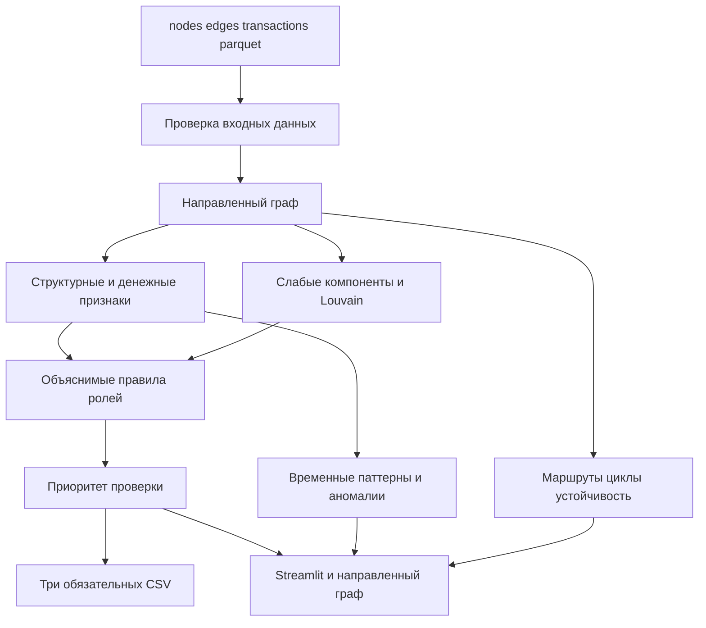

# Архитектура MVP

Система отвечает на вопрос AML аналитика: какие узлы транзакционной сети проверить первыми и какие наблюдаемые признаки объясняют этот выбор.

Расчётное ядро не зависит от интерфейса. `analyze(data_dir)` возвращает таблицы узлов, кластеров, топа, рёбер, отчёт качества и manifest запуска. Интерфейс читает завершённые результаты и не пересчитывает метрики.

## Семантика результатов

- `role` — основная гипотеза о наблюдаемой функции узла.
- `role_score` — сила соответствия экспертному правилу, а не вероятность виновности.
- `priority_score` — сравнительный приоритет ручной проверки.
- `evidence` — короткое числовое объяснение результата.
- `anomaly_score` — отличие оборота и связности от узлов того же колена с учётом временных сигналов и циклов.
- `data_gap` и `next_request` — известный пробел наблюдения и рекомендуемый следующий запрос.

Граничные узлы `depth=4` не классифицируются как `terminal` или `transit`, потому что их дальнейшие исходящие переводы не входят в выгрузку. Для seed не используются роли, зависящие от отношения исходящей суммы к входящей: входящий поток seed неполон.

## Правила версии 1.1

| Роль | Условие допуска |
|---|---|
| consolidator | не менее трёх разных плательщиков |
| distributor | не менее пяти разных получателей |
| transit | вход и выход есть, их отношение 0,8–1,2, узел не seed и не depth=4 |
| terminal | наблюдаемый выход не больше 10% входа, узел не seed и не depth=4, после последнего входа есть два дня наблюдения |
| coordinator | достижим минимум из двух seed, верхние 10% посредничества, соединяет минимум два соседних кластера |
| peripheral | ни одно содержательное правило не прошло |

Все пороги и веса в текущем MVP экспертные. Размеченной выборки нет, поэтому точность ролей не заявляется.

## Масштабирование

Для графа порядка миллиона узлов сохраняются входные и выходные контракты, а pandas и NetworkX заменяются колонночной обработкой и более экономным графовым движком. Посредничество рассчитывается приближённо. Интерфейс получает кластерные агрегаты и локальные подграфы, а не всю сеть. Отдельная графовая база выбирается только при подтверждённой потребности в интерактивных обходах.

